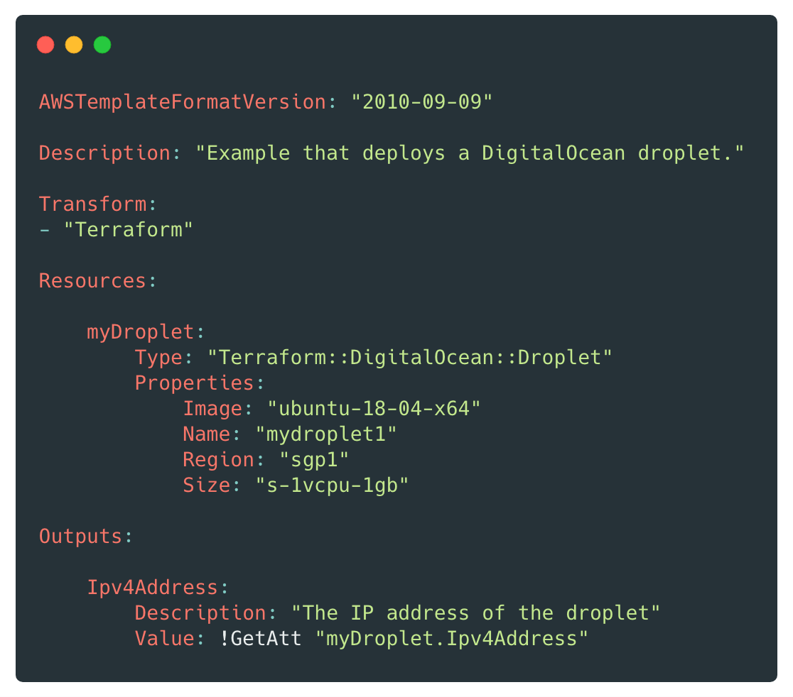

# Terraform CloudFormation Resource Provider

> Deploy over 2,000 new resource types with CloudFormation.

:exclamation: **CAUTION:** This project is currently in beta stages. Some resources may not work as expected and fields may not be validated.

## Installation

Click the above link to deploy the stack which is required to deploy the Transform and Custom Resource handler. This is required to be in place for any future stack deployments.

If you prefer, you can also manually upsert the [custom_resource.yaml](custom_resource.yaml) stack from source and compile your own copy of the Lambda source. Please note that if you do this, the Python requirements must be vendored.

## Usage

Once the handler stack is created, you may use the below resources by adding the `Terraform` transform to your stack. This will transform your input template to convert the Terraform resources into Custom Resources that will handle the lifecycle within that provider.

The following resources are supported (click the link to see documentation):

Provider | Resource
-------- | --------
DigitalOcean | [Terraform::DigitalOcean::Droplet](docs/providers/digitalocean/droplet.md)
